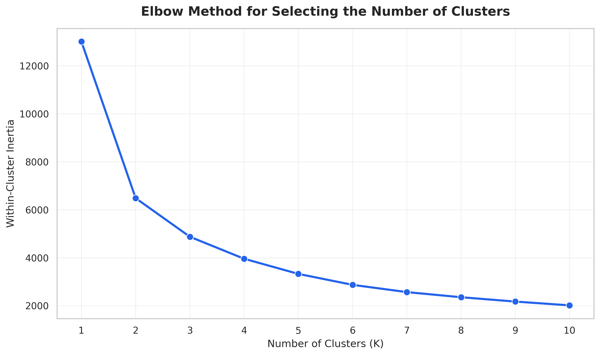
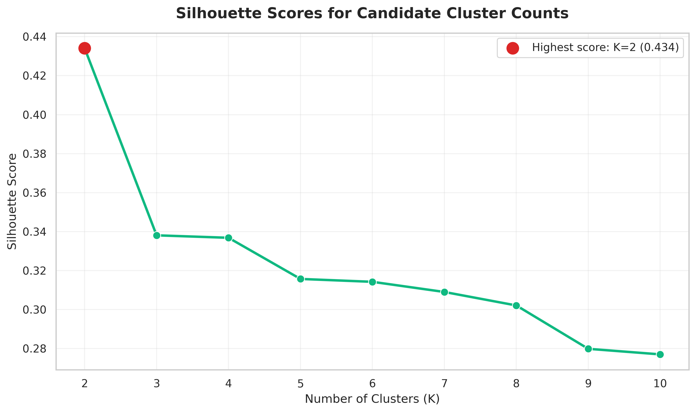
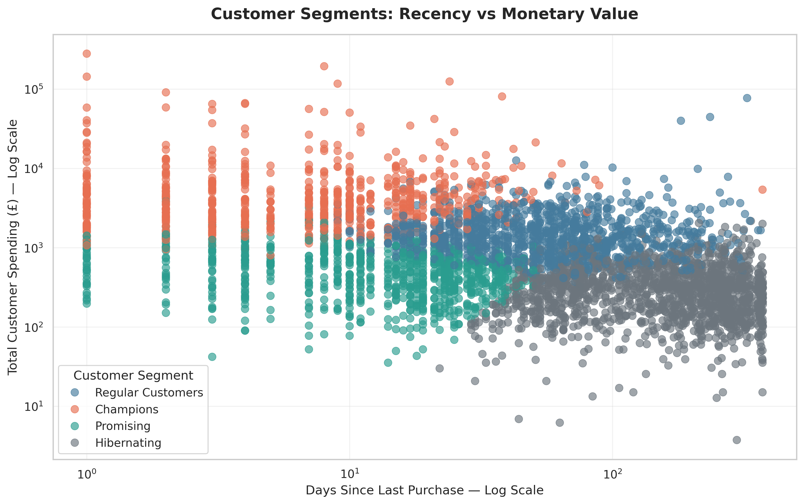
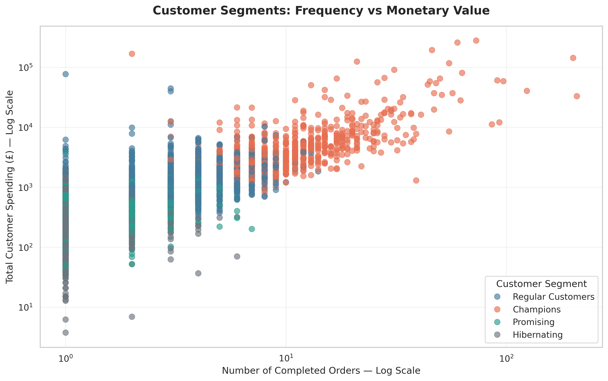
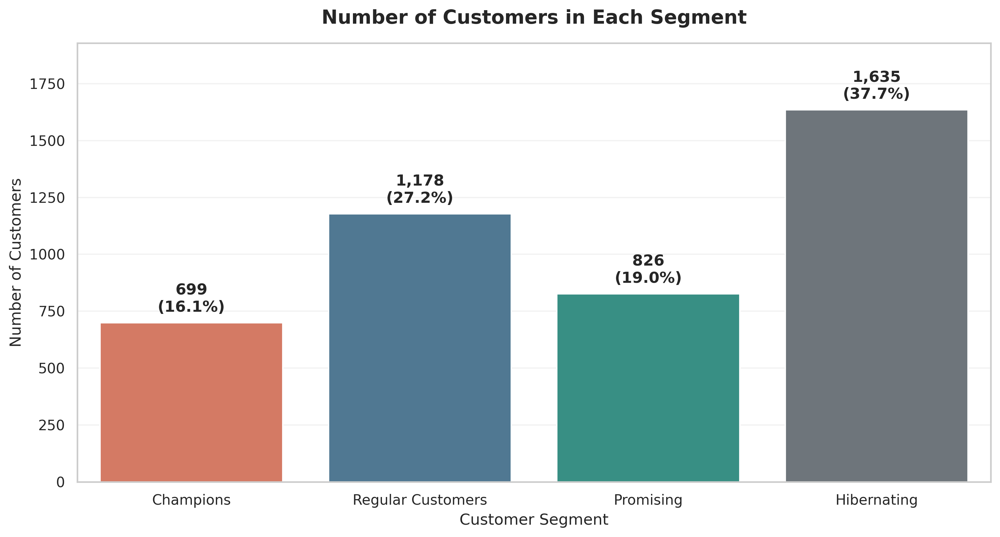

# Task 2 - Customer Segmentation Analysis

Customer segmentation project completed as part of the **Oasis Infobyte Data Analytics Internship Program**.

## Project Objective

This project segments an online retail company's customers into distinct behavioural groups using Recency, Frequency, and Monetary value (RFM). K-Means clustering is used to support targeted retention, loyalty, onboarding, and reactivation strategies.

## Dataset

- **Source:** [UCI Machine Learning Repository - Online Retail](https://archive.ics.uci.edu/dataset/352/online+retail)
- **Original size:** 541,909 transaction rows
- **Period:** December 2010 to December 2011
- **Business:** UK-based non-store online retailer
- **License:** CC BY 4.0

The notebook downloads the official dataset programmatically, so the source Excel file is not stored in this repository.

## Technology Stack

- Python
- pandas and NumPy
- matplotlib and seaborn
- scikit-learn
- Google Colab / Jupyter Notebook

## Data Preparation

The analysis:

1. Inspected column types, missing values, uniqueness, and duplicate rows.
2. Removed duplicate transaction records.
3. Excluded transactions without a CustomerID.
4. Removed cancelled invoices and non-positive quantities or prices.
5. Created TotalPrice as Quantity multiplied by UnitPrice.
6. Aggregated transaction history into one record per customer.

### Cleaned Dataset

- **Valid transaction rows:** 392,692
- **Identifiable customers:** 4,338
- **Completed invoices:** 18,532
- **Recorded revenue:** £8,887,208.89
- **Remaining missing values:** 0
- **Remaining duplicate rows:** 0

## RFM Feature Engineering

Three behavioural features were used:

- **Recency:** Days since the customer's most recent purchase. Lower values indicate more recent activity.
- **Frequency:** Number of distinct completed invoices.
- **Monetary:** Total customer spending during the available period.

Because the dataset covers approximately one year, Monetary is interpreted as observed historical customer value rather than a prediction of future lifetime value.

The RFM features were positively skewed, particularly Frequency and Monetary. A `log1p` transformation reduced the influence of extreme values while retaining wholesale and high-value customers. `StandardScaler` then placed all three features on comparable scales before clustering.

## Model Selection

Candidate values from K=1 through K=10 were evaluated using:

- The Elbow Method
- Silhouette Score
- Business interpretability

K=2 achieved the highest Silhouette Score of 0.434, but it produced only two broad customer groups. **K=4** was selected as a balance between the Elbow Method, moderate separation, and the need for actionable marketing segments. The final K=4 model achieved a Silhouette Score of **0.337**.

## Customer Segments

| Segment | Customers | Customer Share | Avg. Recency | Avg. Frequency | Avg. Monetary | Revenue Share |
|---|---:|---:|---:|---:|---:|---:|
| Champions | 699 | 16.11% | 11.37 days | 13.88 | £8,194.29 | 64.45% |
| Regular Customers | 1,178 | 27.16% | 69.95 days | 4.14 | £1,814.50 | 24.05% |
| Promising | 826 | 19.04% | 17.28 days | 2.18 | £555.80 | 5.17% |
| Hibernating | 1,635 | 37.69% | 180.27 days | 1.32 | £344.24 | 6.33% |

## Key Findings

- Champions account for only 16.11% of customers but generate 64.45% of revenue.
- Regular Customers contribute 24.05% of revenue and are the strongest candidates for loyalty development.
- Promising customers purchased recently but need encouragement to make additional purchases.
- Hibernating customers form the largest group but contribute only 6.33% of revenue.
- Customer quantity alone does not indicate customer financial importance.

## Recommended Marketing Actions

### Champions

Use VIP benefits, early product access, premium bundles, and referral rewards. Prioritize retention without relying on unnecessary discounts.

### Regular Customers

Use personalized recommendations, loyalty points, product bundles, and frequency-based rewards to encourage progression toward the Champion segment.

### Promising

Use onboarding messages, second-purchase incentives, limited-time offers, and recommendations based on previous purchases.

### Hibernating

Use controlled win-back campaigns, reactivation offers, and feedback surveys. Monitor reactivation cost and reduce spending on customers who repeatedly do not respond.

## Key Visualizations

### Elbow Method

### Silhouette Scores

### Recency vs Monetary Value

### Frequency vs Monetary Value

### Customers per Segment

## Output Files

The `outputs` folder contains:

- `recency_distribution.png`
- `frequency_distribution.png`
- `monetary_distribution.png`
- `elbow_method.png`
- `silhouette_scores.png`
- `clusters_recency_vs_monetary.png`
- `clusters_frequency_vs_monetary.png`
- `customers_per_segment.png`

## Repository Structure

~~~text
DataAnalytics-L1-CustomerSegmentation/
├── Elias_Ibrahim_Elias_Task2.ipynb
├── README.md
└── outputs/
    ├── README.md
    ├── recency_distribution.png
    ├── frequency_distribution.png
    ├── monetary_distribution.png
    ├── elbow_method.png
    ├── silhouette_scores.png
    ├── clusters_recency_vs_monetary.png
    ├── clusters_frequency_vs_monetary.png
    └── customers_per_segment.png
~~~

## How to Run

1. Open [Elias_Ibrahim_Elias_Task2.ipynb](./Elias_Ibrahim_Elias_Task2.ipynb) in GitHub or Google Colab.
2. In Colab, select **Runtime → Run all**.
3. The notebook downloads the official UCI dataset automatically.
4. Review the generated tables, charts, cluster profiles, and recommendations.
5. Generated PNG files are written to the Colab `outputs` directory.

## Limitations

- The dataset represents approximately one year of transactions from one UK retailer.
- Monetary value is observed historical spending, not predicted lifetime value.
- K-Means requires K to be selected in advance and is sensitive to changes in customer behaviour.
- Segment assignments should be refreshed periodically with newer transaction data.

## Author

**Elias Ibrahim Elias**  
Data Analytics Intern - Oasis Infobyte
