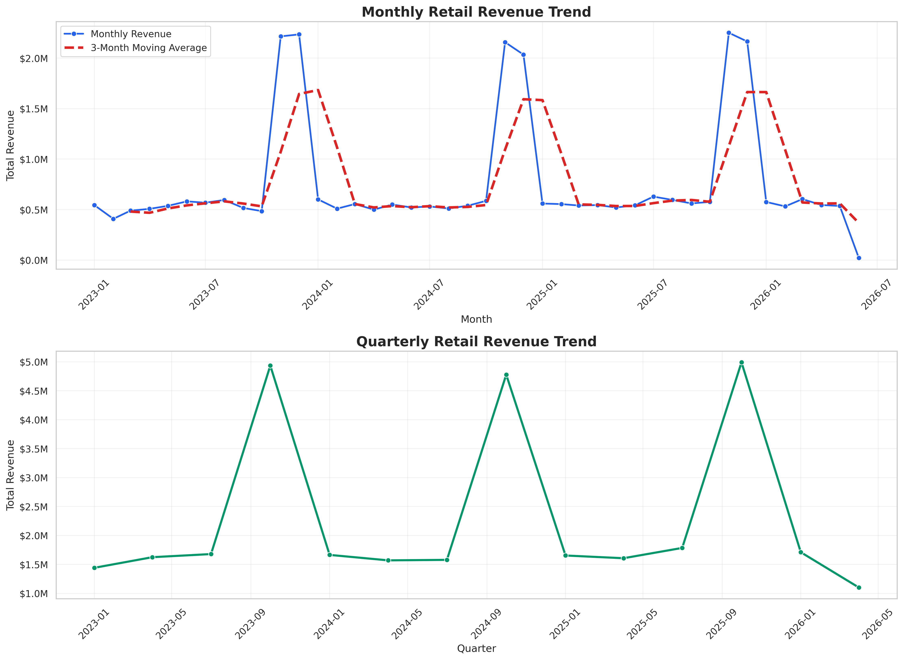
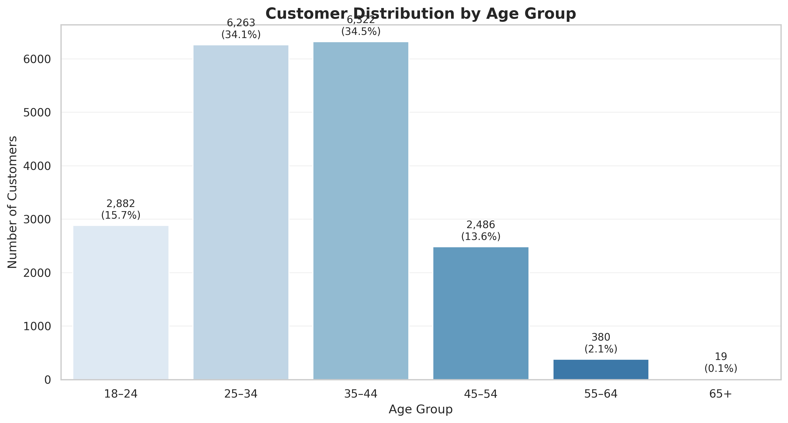
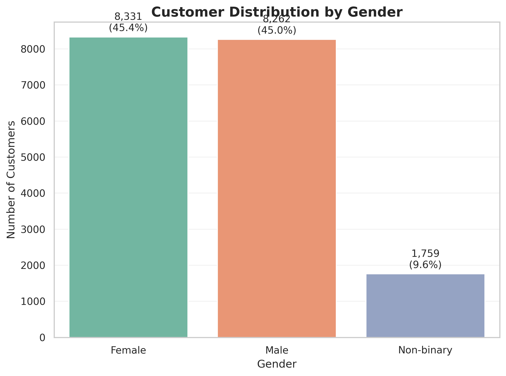
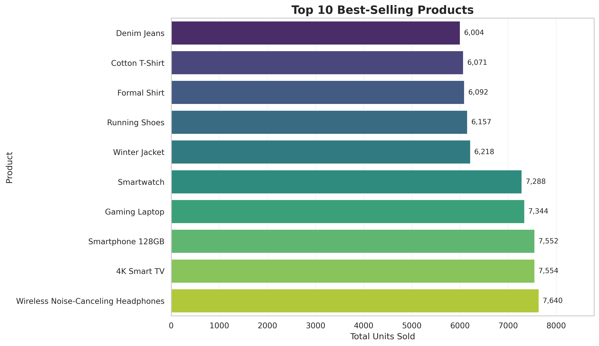
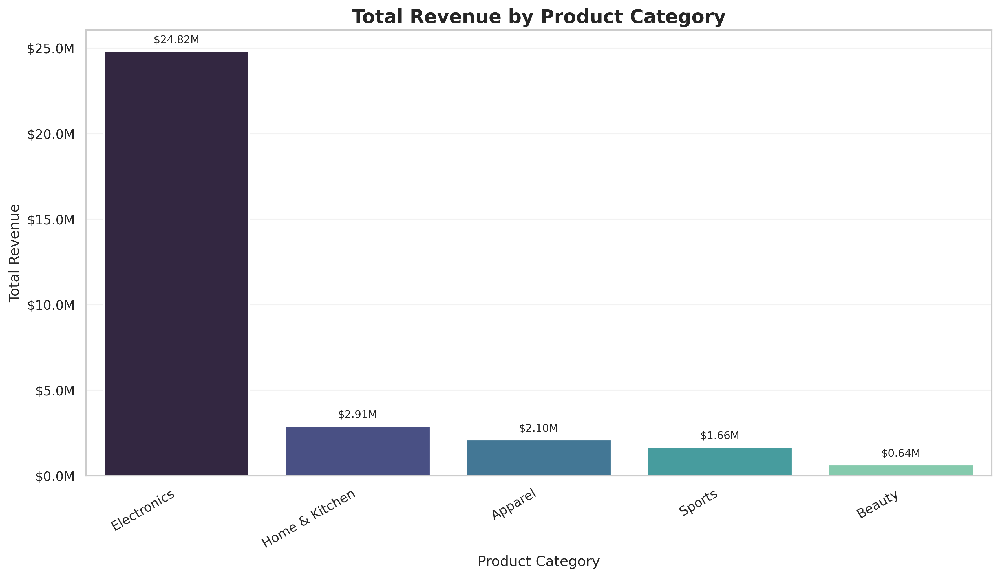
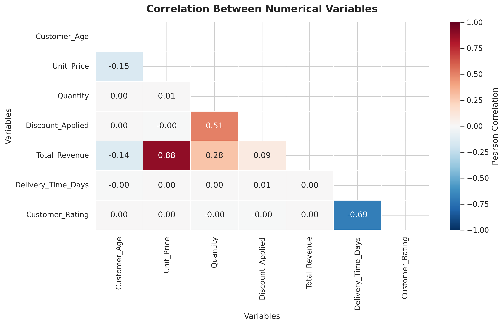
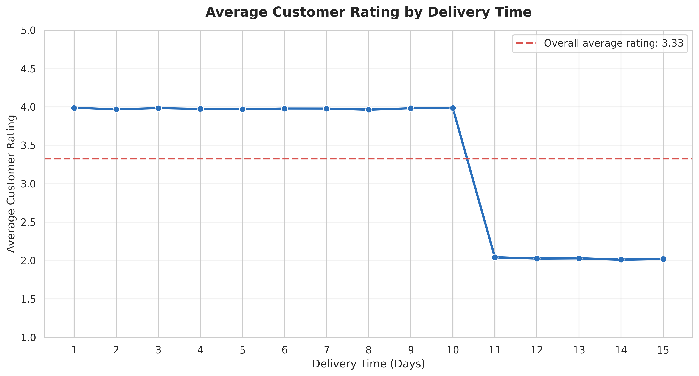

# Task 1 - Exploratory Data Analysis on Retail Sales Data

Retail sales exploratory data analysis completed as part of the **Oasis Infobyte Data Analytics Internship Program**.

## Project Objective

The objective of this project is to perform exploratory data analysis on a retail sales dataset to identify sales patterns, customer behaviour, product performance, and actionable business insights.

The analysis examines:

- Descriptive statistics
- Monthly and quarterly revenue trends
- Customer demographics
- Product and category performance
- Relationships between numerical variables
- The effect of delivery time on customer satisfaction

## Dataset

- **Dataset:** 50K Global Retail Sales & Customer Ratings Data
- **Source:** [Kaggle Dataset](https://www.kaggle.com/datasets/hanzalamushtaq/50k-global-retail-sales-and-customer-ratings-data)
- **Number of rows:** 50,000 transactions
- **Number of columns:** 15
- **Missing values:** 0

The dataset contains synthetic but realistic retail transactions with customer, product, revenue, payment, delivery, and rating information.

The notebook downloads the dataset programmatically using KaggleHub, so the source CSV file is not stored in this repository.

## Technology Stack

- Python
- pandas
- NumPy
- matplotlib
- seaborn
- KaggleHub
- Google Colab / Jupyter Notebook

## Dataset Features

The dataset contains the following columns:

- Transaction ID
- Transaction date
- Customer ID
- Customer age
- Gender
- Location
- Product category
- Product name
- Unit price
- Quantity
- Discount applied
- Total revenue
- Payment method
- Delivery time
- Customer rating

## Analysis Workflow

The project includes:

1. Dataset loading and initial inspection
2. Data-type and missing-value validation
3. Descriptive statistics for numerical variables
4. Monthly and quarterly sales-trend analysis
5. Customer age-group analysis
6. Customer gender-distribution analysis
7. Identification of the ten best-selling products
8. Revenue comparison across product categories
9. Correlation analysis between numerical variables
10. Delivery-time and customer-rating analysis
11. Evidence-based business recommendations

## Descriptive Statistics

The descriptive analysis found that:

- The average customer age was approximately **34.7 years**.
- The average transaction quantity was **2.48 units**.
- The average discount applied was approximately **12%**.
- Average transaction revenue was **USD 642.53**, compared with a median of **USD 244.28**.
- Average delivery time was approximately **8 days**.
- The average customer rating was **3.33 out of 5**.

The substantial difference between average and median revenue indicates that the revenue distribution is positively skewed, with a smaller number of high-value transactions.

## Key Findings

### Sales Seasonality

- November 2025 generated the highest monthly revenue at approximately **USD 2.25 million**.
- The fourth quarter of 2025 generated approximately **USD 4.99 million**.
- Similar fourth-quarter peaks appeared in 2023 and 2024.
- The low values for June 2026 and 2026 Q2 likely result from incomplete final-period data.

### Customer Demographics

- Customers aged **35-44** formed the largest group at **34.5%**.
- Customers aged **25-34** represented **34.1%**.
- Together, customers aged 25-44 represented **68.6%** of the customer base.
- Female customers represented **45.4%**, while male customers represented **45.0%**.
- Non-binary customers represented **9.6%**.

### Product Performance

The three best-selling products were:

1. Wireless Noise-Canceling Headphones - 7,640 units
2. 4K Smart TV - 7,554 units
3. Smartphone 128GB - 7,552 units

The five highest-selling products were all electronics, demonstrating particularly strong demand for technology products.

### Revenue by Category

| Product Category | Approximate Revenue |
|---|---:|
| Electronics | USD 24.82 million |
| Home & Kitchen | USD 2.91 million |
| Apparel | USD 2.10 million |
| Sports | USD 1.66 million |
| Beauty | USD 0.64 million |

Electronics generated approximately **77% of total revenue**, making it the retailer's dominant revenue category.

### Correlation Findings

- Unit Price and Total Revenue had a strong positive correlation of **0.883**.
- Delivery Time and Customer Rating had a strong negative correlation of **-0.688**.
- Quantity and Discount Applied had a moderate positive correlation of **0.506**.
- Quantity and Total Revenue had a weaker positive correlation of **0.283**.

### Delivery Time and Customer Satisfaction

- The Spearman correlation between delivery time and customer rating was **-0.652**.
- Average ratings remained close to **4.0** for deliveries completed within 1-10 days.
- Ratings fell sharply to approximately **2.0** for delivery times of 11 days or longer.
- One-day delivery achieved the highest average rating of **3.99**.
- Fourteen-day delivery produced the lowest average rating of **2.01**.

This result identifies an important **10-day delivery threshold**.

## Business Recommendations

### 1. Prepare for Fourth-Quarter Demand

Inventory and marketing campaigns should be prepared before October to support the recurring increase in fourth-quarter demand.

### 2. Keep Delivery Times Within 10 Days

The retailer should establish a maximum 10-day delivery target, flag orders approaching eight days, and investigate delayed locations or carriers.

### 3. Protect the Electronics Revenue Stream

High-demand electronics should receive priority in inventory planning. The retailer should also maintain reliable relationships with multiple suppliers to reduce stock and supply-chain risks.

### 4. Reduce Category Dependence

The company should test product bundles, targeted promotions, and pricing strategies in Home & Kitchen, Apparel, Sports, and Beauty to reduce dependence on electronics.

### 5. Target the Core Customer Group

Marketing campaigns should prioritize customers aged 25-44 while remaining inclusive because male and female customers are almost equally represented.

### 6. Test Quantity-Based Discounts

Structured bulk discounts should be tested while monitoring revenue, profit margins, and whether discounts produce genuinely higher purchasing quantities.

## Key Visualizations

### Monthly and Quarterly Revenue Trends

### Customer Age Distribution

### Customer Gender Distribution

### Top 10 Best-Selling Products

### Revenue by Product Category

### Correlation Heatmap

### Delivery Time and Customer Rating

## Output Files

The `outputs` folder contains:

- `monthly_quarterly_sales_trends.png`
- `customer_age_distribution.png`
- `customer_gender_distribution.png`
- `top_10_best_selling_products.png`
- `revenue_by_product_category.png`
- `correlation_heatmap.png`
- `delivery_time_vs_customer_rating.png`

## Repository Structure

~~~text
DataAnalytics-L1-EDARetailSales/
├── Elias_Ibrahim_Elias_Task1.ipynb
├── README.md
└── outputs/
    ├── README.md
    ├── monthly_quarterly_sales_trends.png
    ├── customer_age_distribution.png
    ├── customer_gender_distribution.png
    ├── top_10_best_selling_products.png
    ├── revenue_by_product_category.png
    ├── correlation_heatmap.png
    └── delivery_time_vs_customer_rating.png
~~~

## How to Run

1. Open [Elias_Ibrahim_Elias_Task1.ipynb](./Elias_Ibrahim_Elias_Task1.ipynb) in GitHub or Google Colab.
2. In Colab, select **Runtime → Run all**.
3. The notebook downloads the public Kaggle dataset using KaggleHub.
4. Review the generated statistics, visualizations, observations, and business recommendations.
5. Generated PNG images are written to the Colab `outputs` directory.

## Limitations

- The dataset is synthetic, so its results demonstrate analytical techniques rather than representing a specific real retailer.
- The final month and quarter appear incomplete and should not be interpreted as confirmed sales declines.
- Correlation identifies relationships between variables but does not prove causation.
- The identified delivery threshold should be validated with additional real operational data.

## Author

**Elias Ibrahim Elias**  
Data Analytics Intern - Oasis Infobyte
